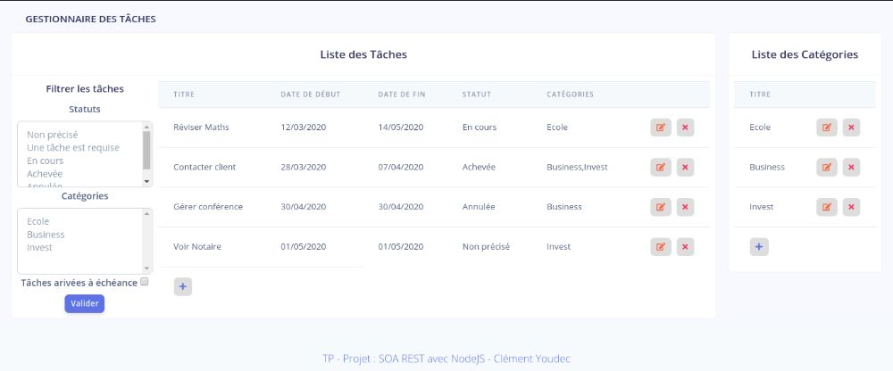

# Gestionnaire de tâches Node.js

## Installation de l'application

1. Suivre les instructions d'installation de l'[API](https://github.com/Hokseed/Todo-API-REST)

2. Cloner le projet depuis github

   `git clone https://github.com/Hokseed/Task_Manager`

3. Aller à la racine du projet

  `cd/Task_Manager`

4. Installer les dépendances

   `npm install`

## Lancement de l'application

  `npm run start`

Aller sur http://localhost:8000/
